<!-- _class: title dark blank -->

# Rush hour-and-a-half: Are peak hours spreading out?

Matt Bhagat-Conway, _University of North Carolina at Chapel Hill_ 
Sam Zhang, _University of Colorado Boulder_

---

<!-- _class: two thirds columns blank -->

# Introduction

- Pre-pandemic, most urban areas struggled with rush-hour traffic congestion
- Travel patterns are likely to change post-pandemic
    - For instance, due to telecommuting and flexible work schedules

######
######

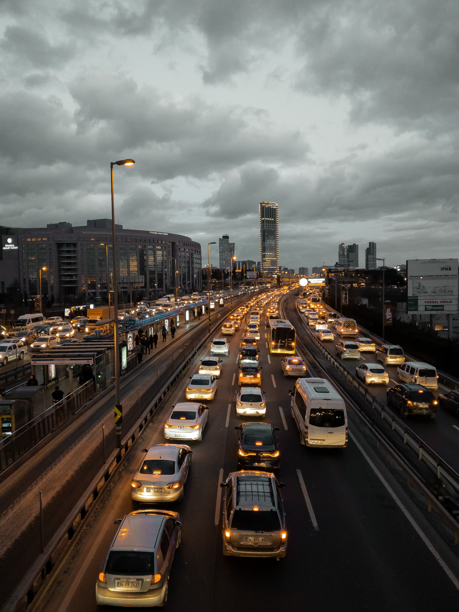

---

# Background and research question

- More people are expecting to telecommute post-pandemic (Salon et al., 2021)
- This may result in less peak-hour travel demand
- People working flexible schedules may spread their trips throughout the day
- **Hypothesis:** Peak times will be longer, but with less total traffic

---

# Data

- 8,102 traffic sensors in California from Caltrans PeMS
- Data in 5-minute increments since January 2016
- Sensors confined to freeway network
    - 81% urban

---

<!-- _class: center blank -->

# Data

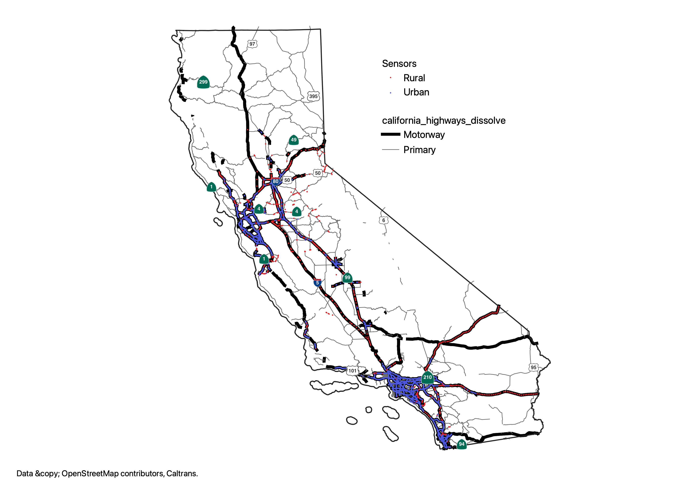

---

<!-- _class: one third columns blank-->

# Data

- Most sensors are loop detectors, some camera or radar detection
- Three outputs
    - Occupancy
    - Flow
    - Speed

######
######

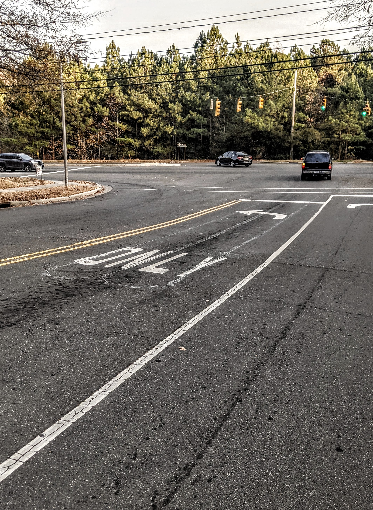

---

# Missing data

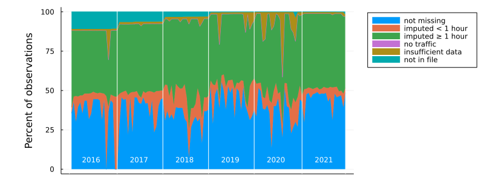

---

# Defining the pre- and post-pandemic period

- "Post-pandemic" period: June 15–July 17, 2021
    - excluding weekends, holidays, days before/after holidays
    - No mask mandate in California
- Pre-pandemic period: Third Tuesday in June–32 days later
    - in each year 2016–2019
    - excluding weekends, holidays, days before/after holidays

---

<!-- _class: center blank -->

# Life almost back to normal for a month

---

<!-- _class: center blank -->

# Traffic almost back to normal in summer 2021

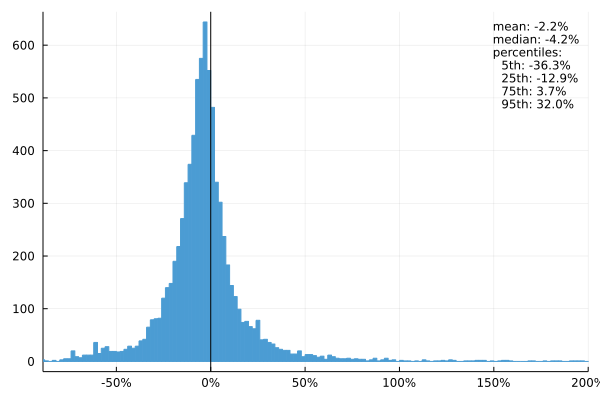

---

<!-- _class: center blank -->

# Theory

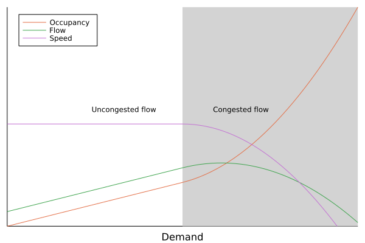

---

# $k$-factors

- What percent of daily occupancy (or flow) occurs during the peak hour?
- Peak hour can start at any 5 minute increment
- Related to engineering $k$-factor, but defined at daily rather than yearly level

---

# Entropy

In math:

$$H(X) = -\sum_{i=1}^n P(x_i) \log P(x_i)$$

- A measure of disorderedness within a system (physics)
- A measure of how much "information" or "surprise" is conveyed in a random variable's outcome (information theory)
- A measure of diversity (ecology)

---

<!-- _class: two columns blank -->

# Entropy in occupancy

- Is occupancy distributed across the hours of a day in a "disordered" (highly entropic) or "peaky" (less entropic) way?

- A measure of peakiness beyond the peak hour. Two distributions with the same peak hour occupancy but different entropies:

######
######

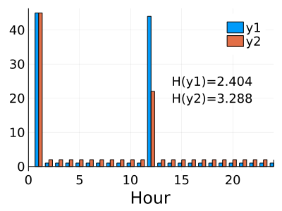

---

# Methods

- For every sensor-day, calculate $k$-factors and entropy
- Compare pre-post pandemic

---

<!-- _class: center blank -->

# Results: $k$-factor

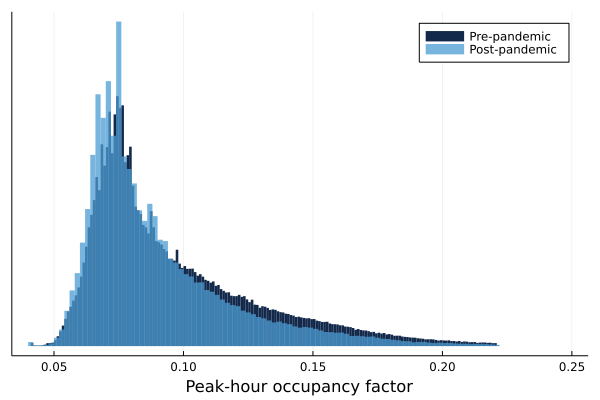

---

<!-- _class: center blank -->

# Results: $k$-factor—time of day

---

<!-- _class: center blank -->

# Results: $k$-factor—time of day

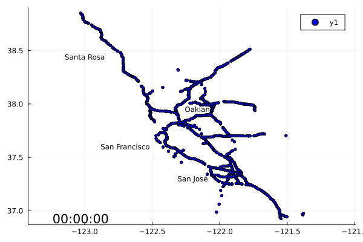

---

<!-- _class: center blank -->

# Results: entropy

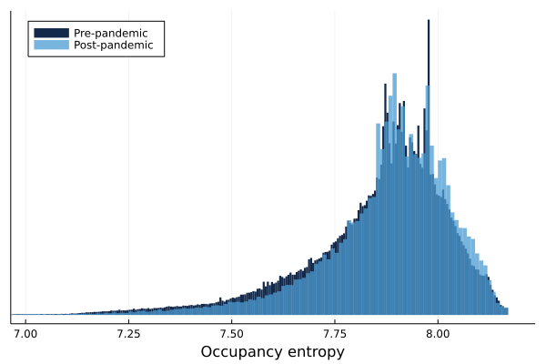

---

# Results

Measure | Value | Interpretation
:-------|:------|:--------------
Occupancy | -0.7% | Less peaky
Entropy | 2.9 centibits | Less peaky

---

# Statistical testing

- Post-pandemic data appears somewhat less peaky
- We use a _permutation test_ to determine if this is statistically-significant

---

# Permutation test

- Theory: if there was no change, any observation could have come from either period with equal probability
- Repeatedly shuffle days between pre- and post-pandemic periods and compute mean difference in $k$-factor and entropy
- Use these values to construct a _sampling distribution:_ how likely a particular mean difference would be if there were no change
- Compare observed difference to sampling distribution, reject null hypothesis of no change if difference more extreme than 95% of distribution

---
<!-- _class: center blank -->

# Permutation test

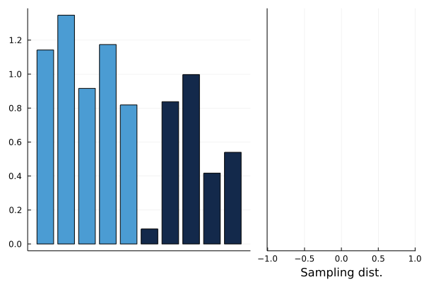

---
<!-- _class: center blank -->

# Permutation test

---
<!-- _class: center blank -->

# Permutation test

---
<!-- _class: center blank -->

# Permutation test

---

# Regional permutation tests

Region | Change in occupancy | $p$ | Change in flow | $p$ | Change in entropy | $p$ | $n$ |
-------|---------------------|-----|----------------|-----|-------------------|---|--|
Urban | -0.0075 | 0.0 | -0.0015 | 0.002 | 0.028 | 0.0 | 6596
Rural | -0.0033 | 0.0 | -0.0035 | 0.0 | 0.032 | 0.0 | 1506

---

# Regional permutation tests

Region | $\Delta$ occupancy | $p$ | $\Delta$ flow | $p$ | $\Delta$ entropy | $p$ | $n$ |
-------|---------------------|-----|----------------|-----|-------------------|---|--|
Sacramento | -0.014 | 0.0 | -0.0024 | 0.0 | 0.043 | 0.0 | 296
Stockton | -0.0008 | 0.18 | -0.0076 | 0.0 | 0.11 | 0.0 | 583
SF | -0.011 | 0.0 | -0.0004 | 0.41 | 0.049 | 0.0 | 2121
Central Coast | 0.00025 | 0.73 | 0.0016 | 0.036 | -0.039 | 0.0 | 344

---

# Regional permutation tests

Region | $\Delta$ occupancy | $p$ | $\Delta$ flow | $p$ | $\Delta$ entropy | $p$ | $n$ |
-------|---------------------|-----|----------------|-----|-------------------|---|--|
Fresno/Bakersfield | -0.0033 | 0.0 | -0.0032 | 0.0 | 0.024 | 0.0 | 401
Los Angeles | -0.0057 | 0.0 | -0.0019 | 0.0 | 0.018 | 0.0 | 1848
Orange County | -0.012 | 0.0 | -0.0072 | 0.0 | 0.029 | 0.0 | 922
Inland Empire | 0.0009 | 0.16 | 0.0003 | 0.57 | -0.02 | 0.0 | 938
San Diego | -0.0093 | 0.0 | 0.00026 | 0.63 | 0.032 | 0.0 | 649

---

<!-- _class: two columns blank -->

# How much are peaks really spreading?

- Robustness check: do peaks spread in both peak occupancy _and_ entropy?
- Answer: only half of sensors (51.1%) exhibit spreading in both measures.
- More peaks are spreading than growing

######
######

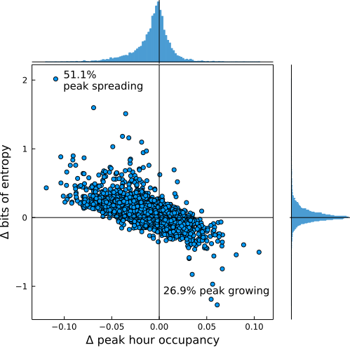

---

# Can peak spreading be explained by changes in flow and occupancy?

1. Fit a model on pre-pandemic data:

$$\log(\text{peak hour occupancy}) \sim \hspace{11em} \\1 + \text{avg daily occupancy} + \text{avg daily flow} + \hspace{1em}\\ \text{district} + \text{urban} \hspace{13em}$$

2. Predict the outcome using post-pandemic data: is the model still a good fit?

---

<!-- _class: center blank -->

# Can peak spreading be explained by changes in flow and occupancy?

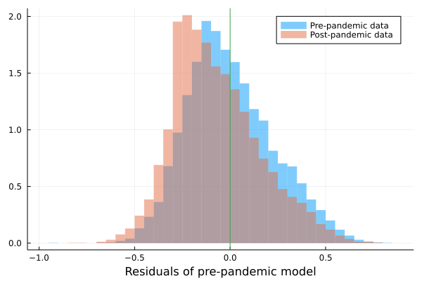

---

# Discussion

- Reduced peakiness results in increased roadway capacity

---

# Future research

- Is the story the same on local roads?
- How has the picture evolved since July?
- Is some of the change in peakiness due to increased crashes outside of the peak?

---

<!-- _class: references blank -->

# References

Salon, D. et al. (2021). The potential stickiness of pandemic-induced behavior changes in the United States. Proceedings of the National Academy of Sciences, 118(27), e2106499118. https://doi.org/10.1073/pnas.2106499118

<!--

---

# Outline

- Research question and background
- Data [Matt]
    - Source, dates
    - Map of all sensors [all on urban freeways]
    * Missing data
    * What is a loop detector
    * Traffic volumes pre-post
    * Summary stats - urban/rural, region, morning vs evening peak (or generally time of day distribution)
    * Sample size
* Theory [Matt]
    * Occupancy vs flow vs speed
    * k
    * entropy [Sam + simulations]
* Methods and results: permutation tests
    * Histogram of k-factor and entropy
    * Permutation tests [Matt]
        * Disaggregate by region
    * Regression [Sam]
* Discussion
    * Increased utilization of road network
    * Future research
        * Can peak spreading ever reduce capacity?
        * Picture on local roads
        * Followup with newer data
        * Features of road that are correlated with changes in peakiness [Sam]
        * Increase in crashes/increased noise postpandemic?
        -->
    

